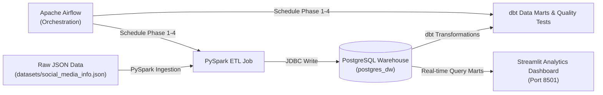

#  Social Media Data Analytics Platform 
This is a complete end-to-end Data Engineering pipeline built with **PySpark**, **PostgreSQL**, **dbt**, **Apache Airflow**, and **Streamlit**.
---
##  Architecture & Pipeline Flow

## Data Warehouse Design & Data Marts

1. Staging Tables (Populated by PySpark)
- stg_users: User demographics (user_id, username, email, age, gender, date_created).
- stg_posts: Post records, metrics, comments count, and all 6 reaction types (like, love, haha, wow, sad, angry).
- stg_post_tags: Exploded post-to-hashtag mapping table (post_id <-> tag).
- stg_comments: Exploded user comments and timestamps.

2. Analytical Data Marts (Transformed via dbt)
- user_engagement: User activity metrics and Dominant Reaction Sentiment (Positive, Funny/Sarcasm, Surprise/Shock, Sad/Empathetic, Negative) based on the max reaction count.
- content_performance: Performance breakdown by post text length (Short, Medium, Long) and viral post rankings.
- tag_analysis: Trending hashtag leaderboard and average engagement rate per tag.
- location_analysis: Regional user activity and post volume per geographic city.

##  Environment Overview
The Docker environment includes the following services specified in the compose file:

- Airflow (UI on Port 8080): Username: airflow, Password: airflow
- PySpark (Notebook on Port 8888, UI for jobs on Port 4040): Container named pyspark.
Any code created should be under the spark_code directory on your host machine.
drivers directory has PostgreSQL JDBC driver allowing Spark to connect to PostgreSQL.
- dbt: Container with dbt installed and the connector to PostgreSQL. Container named dbt.
Created code lives under dbt_project directory on host or /app in the container.
- Postgres Warehouse: Your data warehouse container (postgres_warehouse).
- Database: warehouse, Username: warehouse, Password: warehouse.
- Streamlit Dashboard (UI on Port 8501): Interactive web reporting dashboard container named streamlit_dashboard.

## Pre-requisites & How to Run

- Docker
- Git bash or any unix based terminal

How to Run
Open the terminal and move to the directory.

Make script executable:
chmod u+x ./init.sh
Pull and run the environment:

./init.sh
(Total size of the environment is ~5-6 GB, so the first time running this command requires an internet connection).

To access Jupyter Notebook and use PySpark, run this command in the terminal:
docker logs --tail 20 pyspark
Look for a line that looks like: http://127.0.0.1:8888/lab?token=... Copy and paste the link into your browser.

Access the Streamlit Dashboard at http://localhost:8501.

Access Airflow Web UI at http://localhost:8080 (credentials: airflow / airflow).

## Manual Execution Commands
1. Execute PySpark Ingestion Job:
docker exec -it pyspark spark-submit --driver-class-path /home/jovyan/drivers/postgresql-42.7.3.jar /home/jovyan/work/etl_job.py

2. Execute dbt Models & Data Quality Tests:
docker exec -it dbt dbt run
docker exec -it dbt dbt test

3. Trigger Airflow Pipeline DAG:
docker exec -it interview_env_shared-airflow-webserver-1 airflow dags trigger social_media_analytics_pipeline

## Stop Environment
To close the environment, execute:
docker compose down